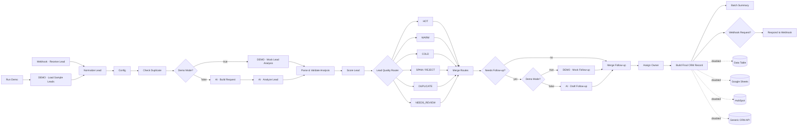

# AI Lead Qualification & CRM Automation (n8n)

An n8n workflow that takes incoming sales leads, cleans them up, scores and classifies them, routes them by quality, drafts a follow-up where one makes sense, assigns an owner, and returns a CRM-ready record.

> **Demo execution using mock AI responses. Production path is ready for external AI and CRM integrations.**
> The demo runs fully offline on 7 fictional leads: no AI API calls, no CRM calls, no cost.


<sub>Screenshots are listed in [docs/SCREENSHOTS.md](docs/SCREENSHOTS.md).</sub>

---

## The problem

Inbound leads arrive from forms, chat widgets and ads in inconsistent shapes. Sales teams lose time on spam and duplicates, good leads wait hours for a reply, and nobody can explain why a lead was marked "hot".

This workflow gives every lead a consistent, **explainable** decision within seconds:

- a 0–100 score with a line-by-line breakdown (`+20 budget fit (strong) | +20 authority ...`)
- a route (HOT · WARM · COLD · SPAM/REJECT · DUPLICATE · NEEDS_REVIEW) with priority, SLA and owner
- a **draft** reply for leads worth answering, written for a human to review and send

## Features

- **Two modes, one workflow.** `config.demo_mode = true` (default) uses a deterministic mock analyzer. `false` switches to a real AI provider with no restructuring.
- **Hybrid scoring.** The AI (or mock) *rates* each dimension; deterministic business rules *decide* the score and route.
- **Business-rule overrides.** Spam, duplicates, incomplete leads and security flags override the score.
- **Duplicate detection** by email or company + last name (in-batch, plus workflow memory in production).
- **Prompt-injection defence.** Lead text is untrusted: it is flagged, never obeyed, and the AI can add risk flags but never clear them.
- **Draft-only follow-ups.** No email node exists. Drafts use `[placeholders]` and are scanned for prices, dates and guarantees.
- **Fail-safe.** A missing, failing, refused or invalid AI response routes the lead to `NEEDS_REVIEW` with the raw data preserved.
- **Provider-agnostic AI path.** Anthropic Messages API or any OpenAI-compatible API via one HTTP node; the model and endpoint live in Config, and the key in an n8n credential.
- **CRM-ready output** for n8n Data Tables, Google Sheets, HubSpot or any CRM API. These nodes are included but disabled.

## Architecture



The canvas is split into colour-coded sections: 🟦 Intake · 🟩 Analysis & Scoring · 🟪 Follow-up Drafts · 🟧 CRM Output · 🟥 Production integrations (disabled until configured). Details: [docs/ARCHITECTURE.md](docs/ARCHITECTURE.md).

## Demo mode vs production mode

| | Demo mode (default) | Production mode |
|---|---|---|
| Switch | `config.demo_mode = true` | `config.demo_mode = false` |
| Lead source | **Run Demo** → 7 fictional leads | **Webhook · Receive Lead** (`POST /webhook/lead-intake`) |
| Analysis | `DEMO · Mock Lead Analysis` (deterministic heuristics) | `AI · Analyze Lead` (HTTP → Anthropic / OpenAI-compatible) |
| Follow-up | `DEMO · Mock Follow-up` (templates) | `AI · Draft Follow-up` |
| CRM / logging | Disabled nodes pass data through | Enable Data Table / Sheets / HubSpot / Generic CRM |
| External calls | **0** | Only the nodes you enable |
| Email sending | **Never** | **Never** (drafts only, human sends) |

The production AI and CRM nodes stay visible on the canvas in both modes. With `demo_mode = false` and the AI nodes still disabled, every lead fails safe to `NEEDS_REVIEW` (this is tested).

## Lead scoring

The AI or mock rates six dimensions. `Score Lead` converts the ratings to points:

| Dimension | Strong | Moderate | Weak |
|---|---|---|---|
| Budget fit | **+20** (≥ 20k) | +12 (5k–20k) | +5 (1k–5k) |
| Authority | **+20** decision-maker | +12 influencer | +5 individual |
| Business need | **+20** specific + committed | +12 genuine, exploring | +4 vague |
| Urgency | **+15** ≤ 30 days | +9 ≤ 90 days | +3 later |
| Service fit | **+15** lead mgmt / CRM / integrations | +8 general automation | 0 |
| Company fit | **+10** target industry & 50–1000 staff | +6 one of the two | +2 |

**Penalties:** −20 unclear intent · −30 very low budget (< 1k) · −50 spam · −100 malicious / prompt injection. The score is clamped to 0–100.

**Bands:** 80–100 HOT · 55–79 WARM · 30–54 COLD · 0–29 REJECT (low value).

**Overrides** (first match wins): analysis failed → NEEDS_REVIEW · security flag → NEEDS_REVIEW · spam → SPAM · duplicate → DUPLICATE · missing required fields → NEEDS_REVIEW (`INCOMPLETE`).

## Routing

| Route | Priority | Suggested SLA | Team | Follow-up |
|---|---|---|---|---|
| HOT | immediate | 15–30 minutes | Senior Sales | Draft: propose discovery call |
| WARM | same_day | Within 4 hours | Sales | Draft: scoping questions |
| COLD | low | Automated nurture sequence | Nurture / Marketing | Draft: resources, low pressure |
| SPAM / REJECT | none | No follow-up | System (auto-archive) | None |
| DUPLICATE | none | No new follow-up | Owner of the original record | None: merge |
| NEEDS_REVIEW | manual | Next business day | Sales Ops | None: human review |

## Demo results (real n8n 2.37.10 run, network disabled)

| Lead | Case | Score | Result | Owner | Draft |
|---|---|---|---|---|---|
| L-1001 Daniel Okafor, Helix Freight Group | Enterprise, approved budget, 3–4 weeks | 96 | **HOT** | Morgan Patel | ✅ |
| L-1002 Sofia Lindqvist, TallyLoop | Seed-stage SaaS, exploring | 74 | **WARM** | Jamie Rivera | ✅ |
| L-1003 Mark Delaney, Brightside Dental | Vague, "maybe next year" | 34 | **COLD** | Nurture queue | ✅ |
| L-1004 "SEO Expert Team" | Backlink spam, disposable email | 0 | **SPAM** | auto-archive | – |
| L-1005 Dan Okafor (same email as L-1001) | Duplicate | 73 | **DUPLICATE** → L-1001 | Morgan Patel (original owner) | – |
| L-1006 "Jordan" | Invalid email, no company | 14 | **NEEDS_REVIEW** (INCOMPLETE) | Sales Ops | – |
| L-1007 Chris Morgan, Vantage Retail | "Ignore all previous instructions…" | 0 | **NEEDS_REVIEW** (security) | Sales Ops | – |

All names, companies, emails (`.example` domains) and phone numbers are fictional.

## Example input

```json
{
  "full_name": "Sofia Lindqvist",
  "email": "sofia@tallyloop.example",
  "company": "TallyLoop",
  "job_title": "Co-founder & Head of Growth",
  "company_size": "11-50",
  "industry": "SaaS",
  "message": "Demo requests come in through our website and we track them manually in a spreadsheet before adding them to HubSpot...",
  "estimated_budget": "$8k-$12k",
  "timeline": "Next 1-2 months",
  "requested_service": "Lead qualification + HubSpot integration"
}
```

The webhook also accepts common aliases (`name`, `first_name` + `last_name`, `company_name`, `budget`, `comments`, …).

## Example output (excerpt)

```json
{
  "lead_id": "L-1001",
  "full_name": "Daniel Okafor",
  "company": "Helix Freight Group",
  "lead_score": 96,
  "lead_temperature": "HOT",
  "qualification_status": "QUALIFIED",
  "priority": "immediate",
  "sla": "15–30 minutes",
  "owner": "Morgan Patel",
  "status": "New – Hot",
  "score_breakdown": "+20 budget fit (strong) | +20 authority level (decision_maker) | +20 business need (strong) | +15 urgency (high) | +15 service fit (strong) | +6 company fit (moderate)",
  "analysis_summary": "VP of Operations at Helix Freight Group (1000-5000 employees, Logistics). Clear, specific need: inbound leads are currently handled manually; leads are tracked in spreadsheets before reaching the CRM; response times to new inquiries are too slow. Budget: $40,000 - $60,000 (strong). Timeline: Within 3-4 weeks.",
  "followup_status": "DRAFT_PENDING_REVIEW",
  "followup_subject": "Next steps: CRM integration & lead routing automation for Helix Freight Group",
  "followup_body": "Hi Daniel,\n\nThanks for reaching out about CRM integration & lead routing automation for Helix Freight Group. From your message, it sounds like inbound leads are currently handled manually. You mentioned a timeline of \"Within 3-4 weeks\", which is helpful context.\n\nI would suggest a short discovery call ...\n\nWould one of these times work for you? [Proposed time slots]\nOr pick a slot that suits you here: [Calendar Link]\n\nBest regards,\nMorgan Patel\n[Your Company]",
  "followup_auto_send": false,
  "model": "mock-analyzer-v1 (demo, no AI call)",
  "demo_mode": true,
  "data_notice": "Demo execution using mock AI responses. Fictional lead data.",
  "raw_input": { "...": "original payload preserved" }
}
```

## Setup (short version)

1. In n8n (tested on **2.37.10**): **Workflows → Create Workflow → ⋯ → Import from File…** → `workflows/ai-lead-crm-automation.json`.
2. Click **Run Demo** (or **Execute workflow** → choose *Run Demo*).
3. Open **Build Final CRM Record** (table view) and **Batch Summary**.

Full instructions, production setup and testing: [docs/SETUP.md](docs/SETUP.md).

## Security notes

- **No secrets in the repo or workflow JSON.** AI and CRM keys go into n8n credentials (Header Auth / HubSpot / Google); `.env.example` has placeholders only.
- **Lead content is untrusted.** Control characters are stripped, the message is capped at 4,000 characters, and injection / markup patterns are flagged. For the AI, the lead goes inside `<lead_data>` tags with explicit "data, not instructions" framing.
- **Deterministic flags win.** The AI can mark a lead as spam or suspicious, but cannot un-flag duplicates, spam signals or injection attempts.
- **Data minimisation.** The AI receives the email *domain*, not the address or phone number.
- **No auto-send.** There is no email node; every draft is `DRAFT_PENDING_REVIEW` with `auto_send = false`.
- **Minimal webhook response.** Form submitters get an acknowledgement only, never scores or internal notes. Add header auth and rate limiting before exposing the webhook publicly.
- **Raw input preserved** on every record for audit and manual review (webhook headers are *not* stored).

## Project structure

```
workflows/ai-lead-crm-automation.json   importable n8n workflow (generated)
code/                                   source of every Code node
prompts/                                AI system prompts + output schema
test-data/sample-leads.json             7 fictional demo leads
scripts/build-workflow.js               builds the workflow JSON from code/ + prompts/ + test-data/
scripts/test-offline.js                 offline checks + simulated runs (plain Node, no deps)
scripts/e2e/                            real n8n end-to-end test in a network-disabled container
docs/                                   setup, architecture, screenshots, portfolio copy
```

## Tech stack

n8n 2.37.10 (Code, Set, IF, Switch, Merge, Webhook, HTTP Request, Data Table, Google Sheets, HubSpot) · JavaScript · Anthropic Messages API or any OpenAI-compatible API (production) · Docker.

## Future improvements

- Look duplicates up in the CRM (e.g. HubSpot search by email) instead of in-batch plus workflow memory
- Enrich leads with company data (size, industry) before scoring
- Human-in-the-loop approval step (Slack or n8n form) that sends approved drafts
- Re-score COLD leads on engagement (email opens, site visits)
- An evaluation set of labelled leads to measure AI vs rules agreement before go-live
- Per-territory owner routing and working-hours-aware SLAs

## Disclaimer

Portfolio demo. The demo output comes from a deterministic mock analyzer, not a language model; the production AI path is implemented and tested for failure handling but ships disabled. All sample data is fictional.
